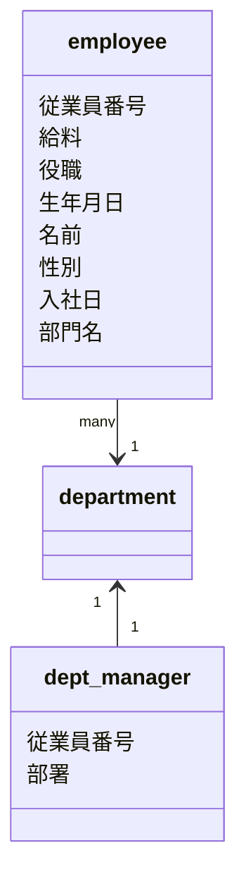

# 目的

# 概念モデリング
目的
概念の名前を整理する

概念の関連を整理する

概念の関連の多重度を整理する

# データベース論理設計

目的
概念モデルを元に作られる。
概念上のエンティティをリレーショナルデータモデルで取り扱いやすい形のテーブルに変形する。

## 非正規形
employee

|従業員番号|名前|生年月日|性別|給料|入社日|役職|部署|
|---|--|----|---|---|-----|---|---|
|10101|田中太郎|1987-02-03|M|200000(2017-05-06-2018-04-01)|2017-05-06|Junior Engineer|開発部|
| ^ |^|^|^|230000(2018-04-01-2019-04-01)|^|Junior Engineer|^|
| ^ |^|^|^|270000(2019-04-01-2020-04-01)|^|Middle Engineer|^|
|10102|中田2郎|1987-02-03|M|200000(2017-05-06-2018-04-01)|2017-05-06|Junior|総務部|
| ^ |^|^|^|230000(2018-04-01-2019-04-01)|^|Junior|^|
| ^ |^|^|^|270000(2019-04-01-2020-04-01)|^|Middle|^|

dept_manager

従業員番号|部署名|開始日|終了日
---------|-----|-----|---
10010|開発部門|20170401|9999-01-01

## 第一正規形
目的：

テーブルのすべての行の全ての列に２つずつ値が入っているべきである。
よって、「繰り返しの列」や「セルの結合」が現れてはならない

今回の処置
employeeテーブルから給料（salaries）、役職(title)を分離する
第一正規形　変形後

employee

|従業員番号|名前|生年月日|性別|入社日|部署|
|---------|---|-------|----|-----|-----|
|10101|田中太郎|1987-02-03|M|2017-05-06|開発部|
|10102|中田２郎|1987-02-03|M|2017-05-06|総務部|

salaries
|従業員番号|給料|開始日|終了日
|--------|----|-----|-----
|10101|Junior Engineer|2017-05-06|2018-04-01
|10101|230000|2018-04-01|2019-04-01
|10101|270000|2019-04-01|2020-04-01
|10102|200000|2017-05-06|2018-04-01
|10102|230000|2018-04-01|2019-04-01
|10102|270000|2019-04-01|2020-04-01

titles

|従業員番号|役職|開始日|終了日
|--------|----|-----|-----
|10101|200000|2017-05-06|2018-04-01
|10101|230000|2018-04-01|2019-04-01
|10101|270000|2019-04-01|2020-04-01
|10102|200000|2017-05-06|2018-04-01
|10102|230000|2018-04-01|2019-04-01
|10102|270000|2019-04-01|2020-04-01

## 第ニ正規形

## 第三正規形

# 参考

はじめての設計をやり抜くための本　第２版
概念モデリング
pp110-123

データベース論理設計
pp147-165

データベース物理設計
pp219-233
