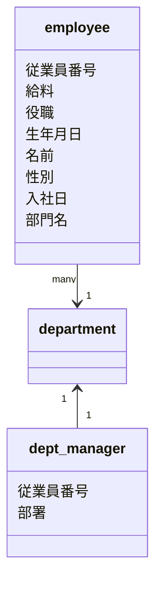

# 目的
データベースの概念モデリングから物理設計を行う
# 概念モデリング
目的
概念の名前を整理する

概念の関連を整理する

概念の関連の多重度を整理する

# データベース論理設計

目的
概念モデルを元に作られる。
概念上のエンティティをリレーショナルデータモデルで取り扱いやすい形のテーブルに変形する。

## 非正規形
employee

|従業員番号|名前|生年月日|性別|給料|入社日|役職ID|役職|部署ID|部署|
|---|--|----|---|---|-----|---|---|---|--|
|10101|田中太郎|1987-02-03|M|200000(2017-05-06-2018-04-01)|2017-05-06|H01|担当|D01|開発部|
| ^ |^|^|^|230000(2018-04-01-2019-04-01)|^|H02|主任|^|^|
| ^ |^|^|^|270000(2019-04-01-2020-04-01)|^|H03|係長補佐|^|^|
|10102|中田2郎|1987-02-03|M|200000(2017-05-06-2018-04-01)|2017-05-06|H01|担当|D02|総務部|
| ^ |^|^|^|230000(2018-04-01-2019-04-01)|^|H02|主任|^|^|
| ^ |^|^|^|270000(2019-04-01-2020-04-01)|^|H04|係長|^|^|

dept_manager

従業員番号|部署ID|部署|開始日|終了日
---------|-----|-----|--|--
10010|D01|開発部|20170401|9999-01-01

## 第一正規形
目的：

テーブルのすべての行の全ての列に２つずつ値が入っているべきである。
よって、「繰り返しの列」や「セルの結合」が現れてはならない

今回の処置
employeeテーブルから給料（salaries）、役職(title)を分離する
第一正規形　変形後

employee

|従業員番号|名前|生年月日|性別|入社日|部署ID|部署|
|---------|---|-------|----|-----|-----|---|
|10101|田中太郎|1987-02-03|M|2017-05-06|D01|開発部|
|10102|中田２郎|1987-02-03|M|2017-05-06|D02|総務部|

salaries
|従業員番号|給料|開始日|終了日
|--------|----|-----|-----
|10101|200000|2017-05-06|2018-04-01
|10101|230000|2018-04-01|2019-04-01
|10101|270000|2019-04-01|2020-04-01
|10102|200000|2017-05-06|2018-04-01
|10102|230000|2018-04-01|2019-04-01
|10102|270000|2019-04-01|2020-04-01

※ 従業員番号と開始日で複合主キー

titles

|従業員番号|役職ID|役職|開始日|終了日
|--------|----|-----|-----|-----|
|10101|H01|担当|2017-05-06|2018-04-01
|10101|H02|主任|2018-04-01|2019-04-01
|10101|H03|係長補佐|2019-04-01|2020-04-01
|10102|H01|担当|2017-05-06|2018-04-01
|10102|H02|主任|2018-04-01|2019-04-01
|10102|H04|係長|2019-04-01|2020-04-01

※ 従業員番号と役職IDで複合主キー

## 第ニ正規形
目的：複合主キーの一部への関数従属を無くす

関数従属性:ある列Aの値が決まれば、一意的に列Bの値も決まる。
今回の場合は、titleテーブルにおいてA=役職ID　B＝役職とする
↓
新しくroleテーブルを作る。
titleテーブルから役職を外す

roles

役職ID|役職名|
-----|------|
H01|担当
|H02|主任|
|H03|係長補佐|
|H04|係長|

titles

|従業員番号|役職ID|開始日|終了日
|--------|-----|-----|-----|
|10101|H01|2017-05-06|2018-04-01
|10101|H02|2018-04-01|2019-04-01
|10101|H03|2019-04-01|2020-04-01
|10102|H01|2017-05-06|2018-04-01
|10102|H02|2018-04-01|2019-04-01
|10102|H04|2019-04-01|2020-04-01

## 第三正規形
目的：間接的な関数従属（推移関数従属）を排除する
推移関数従属とは列A（主キー）,B,Cがあり　A=B　B=C　A!=Cが成り立っているときの状態

今回の場合はemployeeテーブルにおいてA=従業員番号 B=部署ID C=部署として考える。
↓
1.employeeテーブルから部署列を削除する
2.新規テーブルdepartmentsを作成する

employee

|従業員番号|名前|生年月日|性別|入社日|部署ID
|---------|---|-------|----|-----|-----
|10101|田中太郎|1987-02-03|M|2017-05-06|D01
|10102|中田２郎|1987-02-03|M|2017-05-06|D02

departments

部署ID|部署名
---|------
D01|開発部
D02|総務部

# 完成したテーブル
employee

|従業員番号|名前|生年月日|性別|入社日|部署ID
|---------|---|-------|----|-----|-----
|10101|田中太郎|1987-02-03|M|2017-05-06|D01
|10102|中田２郎|1987-02-03|M|2017-05-06|D02

roles

役職ID|役職名|
-----|------|
H01|担当
|H02|主任|
|H03|係長補佐|
|H04|係長|

titles

|従業員番号|役職ID|開始日|終了日
|--------|-----|-----|-----|
|10101|H01|2017-05-06|2018-04-01
|10101|H02|2018-04-01|2019-04-01
|10101|H03|2019-04-01|2020-04-01
|10102|H01|2017-05-06|2018-04-01
|10102|H02|2018-04-01|2019-04-01
|10102|H04|2019-04-01|2020-04-01

departments

部署ID|部署名
---|------
D01|開発部
D02|総務部

# 物理設計
目的

論理設計で決定したことを
DBMS製品に適用する。
具体的には以下のことを決める。
1.テーブル名、列名を決定する。
2.列の型を決定する。
3.制約、デフォルト値を決定する。
4.インデックスを決定する

## 作業内容 テーブル設計仕様書

### employee

論理テーブル名：従業員
物理テーブル名:employees

＃|PK|FK|論理名|物理名|型（桁）|デフォルト|制約
--|---|---|---|---|---|----|---|
1|*|-|従業員番号|employee_id|INTEGER|-|NOT NULL
2|-|-|名前|employee_name|CHAR(25)|-|NOT NULL
3|-|-|生年月日|birthday|DATE|-|NOT NULL
4|-|-|性別|gender|CHAR(1)|-|NOT NULL
5|-|-|入社日|hire_date|DATE|-|NOT NULL
6|-|*|部署ID|departments_id|INTEGER|-|NOT NULL
### role

論理テーブル名：役職
物理テーブル名:roles

＃|PK|FK|論理名|物理名|型（桁）|デフォルト|制約
--|---|---|---|---|---|----|---|
1|*|-|役職ID|role_id|INTEGER|-|NOT NULL
2|-|-|役職名|role_name|CHAR(10)|-|NOT NULL

### salaries

論理テーブル名：給料
物理テーブル名:salaries

＃|PK|FK|論理名|物理名|型（桁）|デフォルト|制約
--|---|---|---|---|---|----|---|
1|*|-|従業員番号|employee_id|INTEGER|-|NOT NULL
2|-|-|給料|salary|INTEGER|-|NOT NULL
3|-|-|開始日|from_date|DATE|-|NOT NULL
3|-|-|終了日|to_date|DATE|-|NOT NULL

まだ途中
### titles

論理テーブル名：従業員の役職
物理テーブル名:titles

＃|PK|FK|論理名|物理名|型（桁）|デフォルト|制約
--|---|---|---|---|---|----|---|

### departments

論理テーブル名：部門
物理テーブル名:departments

＃|PK|FK|論理名|物理名|型（桁）|デフォルト|制約
--|---|---|---|---|---|----|---|

#　用語
用語名|説明
-----|----
主キー|データ行を一意に識別するための項目
複合主キー|2つ以上の項目を見ることで一意に識別するための項目たち
部分関数従属|ある列複合主キーAの値が決まれば、一意的に列Bの値も決まる。A=Bのとき第ニ正規形に変形するときに考慮する
推移関数従属|列A,B,Cがあり、Aが決まるとBも決まり、Bが決まるとCも決まる関係 A=BかつB=C(A!=Cも成り立つ) 第三正規形のときに考慮する
第一正規形|繰り返し部分を排除するための変形する
第ニ正規形|部分関数従属を無くすための変形
第三正規形|推移関数従属を無くすための変形
論理名|論理設計までの段階で利用してきた名前
物理名|最終的にデータベース内で作られるテーブル名や列名を
PK|Primary Key　主キーの言い換え
FK|Foreign Key 
# 参考

はじめての設計をやり抜くための本　第２版
概念モデリング
pp110-123

データベース論理設計
pp147-165

すっきりわかるSQL
 第一正規形:pp398-401
 第二正規形:pp401-403
 第三正規形:pp404-406

データベース物理設計
pp219-233
